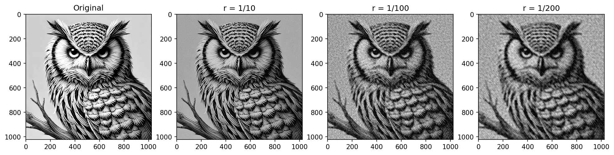

# Python FFT Image Compression

A Python implementation of 2D Fast Fourier Transform (FFT) based image 
compression.

## Overview

This project demonstrates how the Fast Fourier transform (FFT) can be used to compress 
images by discarding low-magnitude frequency coefficients. This is the same 
underlying principle used in JPEG compression — one of the most widely used 
image formats in the world.

## Project Structure

| Notebook Section | Description |
|---|---|
| Image Generation | Creates striped, horizontal and dot images using PIL |
| FFT & Power Spectrum | Computes 2D FFT, visualises log power spectrum, verifies inverse FFT |
| Thresholding | Applies frequency thresholding and plots g(T) |
| Image Compression | Compresses images to specified ratios using scipy bisection algorithm |

## Key Concepts

- **2D Discrete Fourier Transform (DFT)** — decomposes an image into its frequency components
- **Power Spectrum** — visualises the magnitude of frequency components
- **Thresholding** — setting small FFT coefficients to zero to compress data
- **Lossy compression** — image quality degrades as compression ratio increases

## g(T) Curve

The graph below shows how the number of non-zero FFT coefficients decreases 
as the threshold T increases. Most coefficients are small — only a few carry 
the majority of the image information.

## Compression Results

An owl image compressed at three different ratios — original shown on the left:

| Compression Ratio | Data Used | Visual Quality |
|---|---|---|
| r = 1/10 | 10% | Near identical to original |
| r = 1/100 | 1% | Clearly recognisable, some noise |
| r = 1/200 | 0.5% | Recognisable but noisy |

## Libraries Used

- `PIL` — image creation and loading
- `numpy` — FFT computation
- `matplotlib` — visualisation
- `scipy` — bisection algorithm for finding compression threshold

## Author - FH
